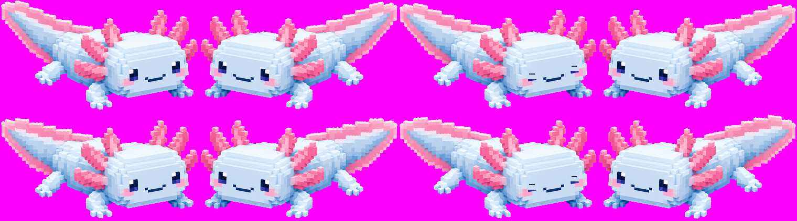

<<<<<<< HEAD
# 아루 - 파란 아홀로틀 데스크톱 펫

바탕화면 위를 헤엄쳐 다니는 파스텔톤 복셀 아홀로틀입니다. AI로 생성한 정지 이미지
한 장(`axolotl.png`) 위에 코드로 움직임을 얹는 방식입니다. 배경이 투명한 항상-맨-위
창이라 다른 창 위를 자유롭게 돌아다닙니다.



## 실행

```bash
run.bat
```

또는 직접:

```bash
pythonw axo.py
```

필요한 것: Python 3.9+ 와 Pillow (`pip install pillow`). tkinter 는 Windows 파이썬에 기본 포함입니다.

## 조작

| 동작 | 결과 |
| --- | --- |
| 클릭 | 반응하며 말풍선 + 물방울 |
| 드래그 | 원하는 위치로 옮기기 |
| 오른쪽 클릭 | 메뉴 |
| Esc | 종료 |

메뉴에서 할 수 있는 것

- **놀아주기** — 신나게 헤엄치며 물방울을 뿜습니다
- **자유롭게 헤엄치기 / 마우스 따라다니기 / 가만히 있기**
- **집중 타이머 25분** — 타이머 동안은 천천히 조용히 움직이고, 남은 시간이 머리 위에 표시됩니다. 끝나면 축하해 줍니다
- **크기** — 작게 / 보통 / 크게
- **항상 맨 위**, **오른쪽 아래로 보내기**, **종료**

창 테두리가 없어서 작업표시줄에는 나타나지 않습니다. 종료는 오른쪽 클릭 메뉴 또는 Esc 로 하세요.

위치·모드·크기는 `%APPDATA%\axopet\config.json` 에 저장되어 다음 실행 때 복원됩니다.

## 구성

| 파일 | 역할 |
| --- | --- |
| `axo.py` | 창, 행동(배회·따라다니기·드래그), 물방울, 말풍선, 집중 타이머 |
| `sprite.py` | 정지 이미지 위에 애니메이션을 얹는 스프라이트 모듈 |
| `axolotl.png` | 배경을 제거해 둔 아홀로틀 원본 이미지 (실제로 쓰는 에셋) |
| `image.png` | 배경 제거 전 원본 (에셋 아님, 참고용으로만 보관) |

### sprite.py 에 대해

3D 렌더링이 아니라, `axolotl.png` 정지 이미지 한 장에 2D 후처리 트릭으로
움직임을 얹는 방식입니다.

- **꼬리 파도**: 이미지를 열(column) 단위로 쪼개서 각 열마다 위상이 다른 세로 이동을
  줍니다. 머리/몸통 쪽은 가중치 0이라 안 움직이고 꼬리 끝으로 갈수록 많이 흔들려서,
  깃발이 출렁이는 것처럼 보입니다
- **깜빡임**: 미리 찾아둔 눈 좌표(`EYE_BOXES`) 위치를 얼굴색으로 덮고 얇은 감은-눈
  선을 그립니다
- **좌우 반전**: 새로 그리지 않고 이미지를 그대로 뒤집습니다 (`ImageOps.mirror`)
- 이 세 가지를 (위상 x 기분 x 눈뜸) 조합별로 한 번씩만 만들어 캐시하고, 매 틱마다는
  캐시에서 꺼내 쓰기만 합니다

`python sprite.py 2` 로 실행하면 해당 배율의 `preview.png` 시트를 뽑고 출력 크기를 알려줍니다.

### 알아두면 좋은 것

- **투명 배경**은 tkinter 의 `-transparentcolor`(컬러 키) 방식이라 이진 투명만 가능합니다.
  `axolotl.png`는 원본을 순수 마젠타 단색 배경으로 뽑은 뒤 컬러키로 잘라낸 것인데, 이때
  가장자리 반투명 픽셀에 배경색이 아직 섞여 있는 상태라 그냥 축소하면 옅은 마젠타 테두리가
  생깁니다. 그래서 premultiplied alpha 로 축소한 뒤 다시 풀어내는 방식으로 색이 안 번지게
  했습니다 (`_resize_rgba`)
- **원본 배경이 방사형 그라데이션/글로우인 경우** 컬러키로 못 잘라냅니다 — 배경이 캐릭터
  바로 옆에서 거의 흰색으로 밝아지는데 캐릭터 몸통도 흰색이라 경계가 안 보입니다. 이미지를
  다시 뽑을 일이 있으면 "flat solid background, no glow, no vignette" 를 꼭 명시하세요
- **리사이즈는 배율이 바뀔 때 딱 한 번만** 합니다(`set_scale()` 안에서 `_base` 를 미리
  만들어 둠). 꼬리 파도/깜빡임처럼 매 프레임 달라지는 편집은 이미 작아진 `_base` 위에서
  처리해서, 프레임 하나 만들 때마다 원본(1248x697)을 다시 축소하지 않습니다. 이 순서를
  거꾸로 하면(원본에 편집 후 매번 축소) 시작할 때 프리웜이 5초 가까이 걸립니다
- **DPI 배율**을 먼저 인식시킵니다(`SetProcessDpiAwareness`). 이걸 안 하면 Windows 가 창을
  통째로 늘려버려 스프라이트가 뿌옇게 뭉개집니다.
- 드래그할 때 크기를 건드리지 않습니다. (드래그하면 캐릭터가 계속 커지는 흔한 버그를
  피하려고 위치만 바꿉니다.)
=======
# axolotl-pet
>>>>>>> 1d17bd865155a983f16b517afcdd559647e1f5df
